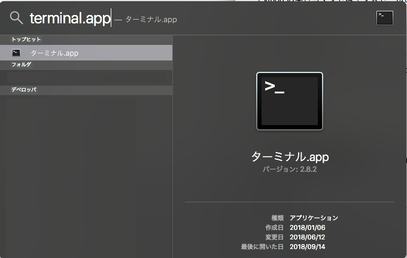
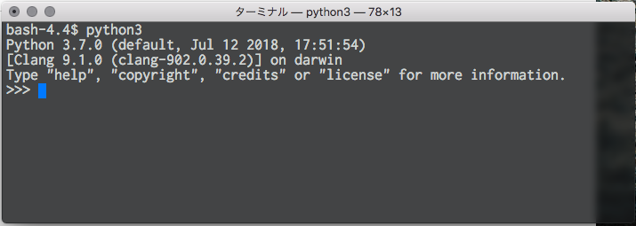
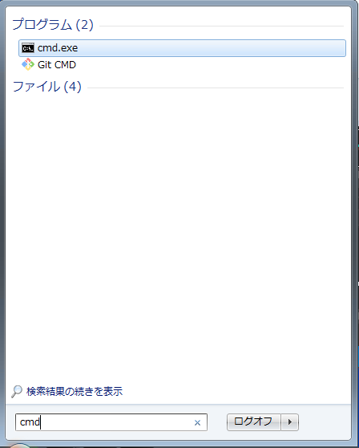
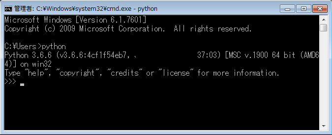

# PyCon 2018 チュートリアル用サンプルコード

このリポジトリは PyCon 2018 チュートリアルコース「動かして学ぶ、はじめての Python」に使用するサンプルプログラムです。

<https://pyconjp.connpass.com/event/94980/>

# 読み進める際の注意点

## python コマンドについて

Python の実行コマンドはインストールされて環境によって `python` もしくは `python3` となっています。
これらはご自身の環境によって適宜読み替えてください。

よくわからない場合は `python3` 、 `python` の順にコマンドを試して動作したものを使ってください。

## ターミナル

コマンド実行環境のことをターミナルといいます。

### Mac

Spotlight検索から「terminal.app」を探します。



以下のようなターミナルが開きます。



ディレクトリをドラックして terminal.app にドロップすると、そのディレクトリへのパスが入力されます。ダウンロードしたソースコードのディレクトリに移動するために便利です。

### Windows

左下の Windows ボタンから「cmd」を検索して探します。「cmd.exe」をクリックして実行します。



以下のようなターミナルが開きます。



フォルダをドラックしてコマンドプロンプトにドロップすると、そのディレクトリへのパスが入力されます。ダウンロードしたソースコードのディレクトリに移動するために便利です

# 開発環境構築について

## 共通

### Atom のインストール
* [Atom](https://atom.io/) より実行ファイルをダウンロードして、インストールしてください。

## Mac

### Python3 のインストール
* [macOS環境のPython](https://www.python.jp/install/macos/index.html) から 「Python3のインストール」の手順を実行してください。
* terminal.app で以下のコマンドを実行してバージョンを確認してください。

```bash
$ python -V
Python 3.6.6
```

* Python のバージョンは 3.6.0 以上が必要です

## Windows

### Python3 のインストール
* [Python3のインストール](https://www.python.jp/install/windows/install_py3.html) の手順を実行してください。
*  "Add Python 3.x to PATH" のチェックを忘れないようにご注意ください。

### Python の環境変数 PATH の設定確認
* コマンドプロンプトにて以下のコマンドを実行してください。

```bash
$ python -V
Python 3.6.6
```

* 以下のような結果となった場合、PATH が通っていない可能性があります。

```bash
'python' は、内部コマンドまたは外部コマンド、
操作可能なプログラムまたはバッチ ファイルとして認識されていません。
```

* Python のバージョンは 3.6.0 以上が必要です

### 環境変数 PATH のトラブルシューティング
* [Python3のインストール](https://www.python.jp/install/windows/install_py3.html) にてダウンロードしたexeファイルを実行してください。
* Uninstall を実行してください。
* 再度、[Python3のインストール](https://www.python.jp/install/windows/install_py3.html) にてダウンロードしたexeファイルを実行してください。
* "Add Python 3.x to PATH" のチェックを忘れないようにご注意ください。
